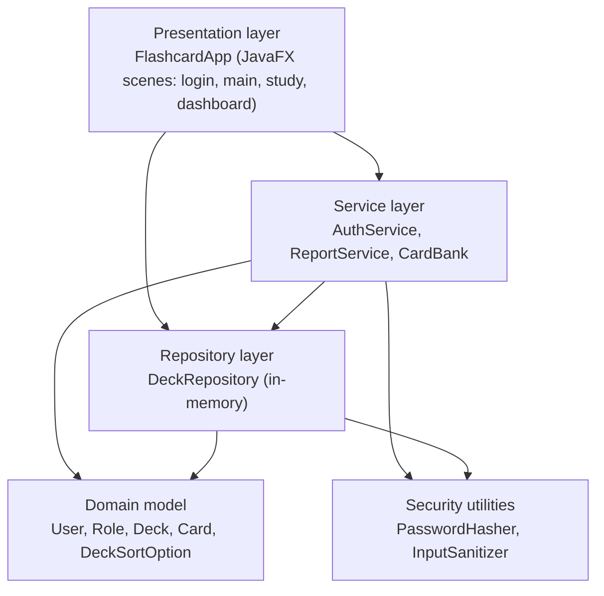
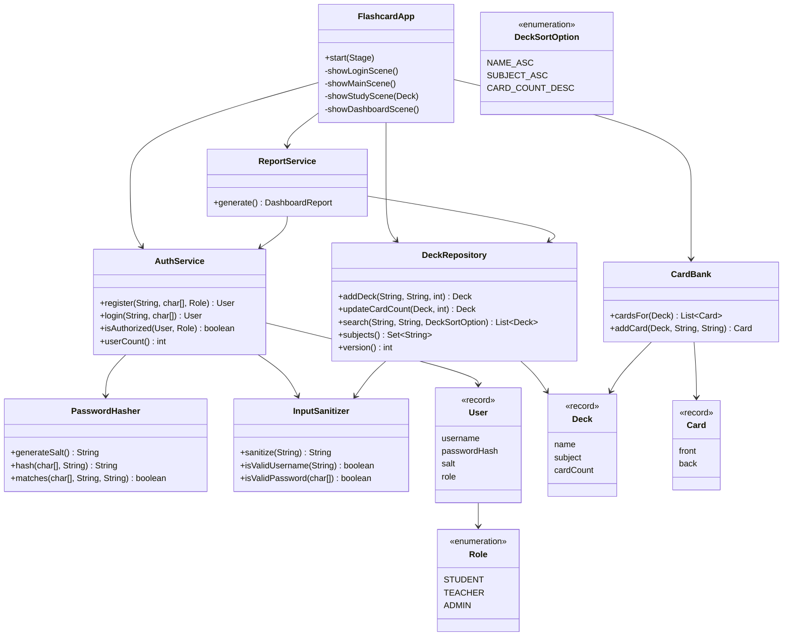
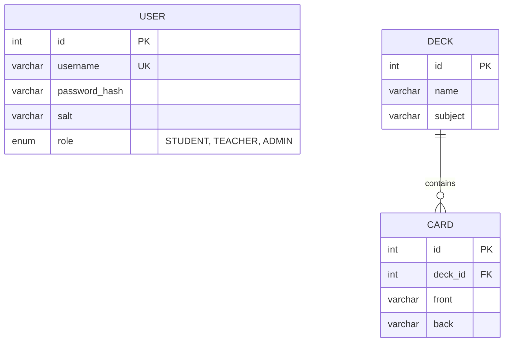

# Studycard - Online Flashcard System

A JavaFX desktop application for studying with flashcards. Students browse decks and study cards, teachers create decks and cards, and administrators view an analytics dashboard.

## Table of Contents

1. [Project Overview & Objectives](#1-project-overview--objectives)
2. [Technology Stack & Dependencies](#2-technology-stack--dependencies)
3. [Design & Development Methodology](#3-design--development-methodology)
4. [Functional Testing](#4-functional-testing)
5. [Setup & Execution Instructions](#5-setup--execution-instructions)
6. [Team](#team)

---

## 1. Project Overview & Objectives

**Problem domain.** Learners often study from scattered notes, and teachers have no simple way to share structured study material with a class. Studycard is a focused flashcard tool that addresses both.

**Intended users**

| Role | Capabilities |
|------|--------------|
| Student | Register and sign in, browse and search decks, filter by subject, study cards (flip, previous, next) |
| Teacher | Everything a student can do, plus create decks and add cards to a deck |
| Administrator | Everything a teacher can do, plus view the analytics dashboard |

**Core functionality**

- Authentication (register / login) with role-based authorization (`STUDENT`, `TEACHER`, `ADMIN`)
- Deck list with free-text search (deck name or subject) and subject filter
- Study mode: flip a card between question and answer, move through the deck
- Content management for teachers and admins: add decks and add cards
- Administrator dashboard: total decks, total cards, average cards per deck, registered users, decks per subject

**Goals**

- Business: make studying easier and more engaging, and let teachers share material with students.
- Technical: a clean layered design, secure handling of credentials and user input (OWASP-aware), automated unit testing with coverage reporting, a CI pipeline, and a containerised runtime.

**Current scope.** The application is a prototype. Data (users, decks, cards) is held in memory and is reset when the application closes. Three demo accounts are seeded on start-up (see [Setup](#5-setup--execution-instructions)).

---

## 2. Technology Stack & Dependencies

| Area | Technology | Version |
|------|------------|---------|
| Language / runtime | Java (JDK) | 21 (`maven.compiler.release=21`) |
| UI framework | JavaFX (`javafx-controls`) | 21.0.4 |
| Build tool | Apache Maven | 3.9+ |
| Unit testing | JUnit Jupiter (JUnit 5) | 5.11.0 |
| Test runner | maven-surefire-plugin | 3.5.0 |
| Code coverage | JaCoCo (`jacoco-maven-plugin`) | 0.8.12 |
| JavaFX run plugin | `javafx-maven-plugin` | 0.0.8 |
| Continuous integration | Jenkins (`Jenkinsfile`) | Maven tool, JUnit and JaCoCo publishers |
| Containerisation | Docker, base image `eclipse-temurin:21-jdk` | JavaFX SDK 21.0.4 (Linux) downloaded in the image |
| Source control | Git / GitHub | - |

**Runtime and platform notes**

- No external runtime dependencies other than JavaFX. Password hashing uses the JDK's built-in PBKDF2 (`javax.crypto`), so no third-party security library is needed.
- The JavaFX native classifier defaults to Windows (`javafx.platform=win` in `Project/pom.xml`). Override it with `-Djavafx.platform=linux` for Linux builds.
- **Database:** no database is used by the current prototype; all data is stored in memory. The original plan was MariaDB for persistence (see the planned ER design in [Section 3](#er-design-planned-persistence)).
- **Localisation:** no localised resource bundles are used; the UI is English only.
- The Docker image renders the JavaFX window over X11, so running it on Windows needs an X server (for example Xming or VcXsrv).

---

## 3. Design & Development Methodology

### Architectural pattern

The application follows a **layered architecture** with a clear split between the presentation layer and the domain/service layer. The domain and service classes have no dependency on JavaFX, which is why they can be unit tested without a UI.



| Layer | Classes | Responsibility |
|-------|---------|----------------|
| Presentation | `FlashcardApp` | Builds and switches the JavaFX scenes, handles user events, shows validation errors |
| Service | `AuthService`, `ReportService`, `CardBank` | Registration/login/authorization, dashboard analytics (cached), card content per deck |
| Repository | `DeckRepository` | Stores decks and provides validated insert, search, subject filtering and sorting |
| Domain | `User`, `Role`, `Deck`, `Card`, `DeckSortOption` | Immutable records/enums with validation in their constructors |
| Security utilities | `PasswordHasher`, `InputSanitizer` | Salted PBKDF2 hashing, input validation and sanitisation |

### UML class diagram



### ER design (planned persistence)

The prototype keeps data in memory. The relational design below is the planned MariaDB schema that would replace the in-memory collections.



### Security-oriented design decisions

- **Password storage (OWASP A02):** passwords are never stored in plain text. `PasswordHasher` uses PBKDF2WithHmacSHA256 with a random 16-byte salt per user, 120,000 iterations and a 256-bit key, and compares hashes in constant time.
- **Input handling (OWASP A03):** `InputSanitizer` strips control characters and `<`/`>` markup delimiters, trims and caps input at 120 characters. Usernames must match `[A-Za-z0-9._-]{3,32}` and passwords need at least 8 characters.
- **Authorization:** `AuthService.isAuthorized` implements a role hierarchy (`ADMIN` > `TEACHER` > `STUDENT`). The UI only shows content-management controls to teachers/admins and the dashboard to admins.
- **Generic login errors:** a failed login always returns "Invalid username or password" so it does not reveal whether a username exists.
- **Performance:** `ReportService` caches the dashboard report and recomputes it only when `DeckRepository.version()` changes.

### Development process

- **Iterative, sprint-based (Scrum-style) development** by a team of three. Sprint planning and review documents are in [docs/](docs/): the product vision report, the project plan, and the Sprint 1 and Sprint 2 review reports.
- **Version control:** Git with a shared GitHub repository.
- **Test-supported development:** domain and service logic is covered by JUnit tests that run on every build.
- **Continuous integration:** the `Jenkinsfile` defines a pipeline with the stages Checkout, Build (`mvn clean install`), Test (`mvn test`), Code Coverage (`mvn jacoco:report`), Publish Test Results (JUnit XML) and Publish Coverage Report (JaCoCo).
- **Containerisation:** the `Project/Dockerfile` packages the built jar together with the Linux JavaFX SDK so the app runs the same way on any machine with Docker.

---

## 4. Functional Testing

### Methodology

1. **Automated unit tests (JUnit 5).** Every domain, service, repository and security class has a test class under `Project/src/test/java/com/flashcards/`. Tests run with `mvn test` and as part of every `mvn package`/`mvn verify`, and the same command is run by the Jenkins pipeline.
2. **Coverage measurement (JaCoCo).** `mvn verify` writes an HTML/CSV report to `Project/target/site/jacoco/`.
3. **Manual functional testing of the UI.** The JavaFX layer is exercised by hand through the Docker image (and with `mvn javafx:run`) using the scenarios in the table below. This approach found a real defect: adding a second card to a deck failed with "Deck not found" because the study screen held a stale immutable `Deck`. It was fixed by tracking the updated deck after each card is added.

### Automated test results

Last run: `mvn clean package` - **33 tests, 0 failures, 0 errors, 0 skipped** (BUILD SUCCESS).

| Test class | Tests | Area verified |
|------------|------:|---------------|
| `AuthServiceTest` | 6 | Register/login, wrong password, unknown user, case-insensitive duplicate usernames, weak credentials, role hierarchy |
| `PasswordHasherTest` | 4 | Same salt gives same hash, different salts give different hashes, match check, empty password rejected |
| `InputSanitizerTest` | 5 | Markup/control-character stripping, trimming and length cap, null input, username and password validation |
| `DeckTest` | 3 | Card summary text, singular wording, rejection of empty details |
| `DeckRepositoryTest` | 6 | Search by name/subject, subject filter, sorting, sanitised insert and version counter, unique subjects |
| `CardTest` | 2 | Text trimming, rejection of blank sides |
| `CardBankTest` | 4 | Seeded cards, case-insensitive lookup, generated placeholder cards that stay cached |
| `ReportServiceTest` | 3 | Totals and per-subject breakdown, report caching, registered-user count |
| **Total** | **33** | |

### Code coverage (JaCoCo, `mvn verify`)

| Scope | Line coverage | Instruction coverage |
|-------|--------------:|---------------------:|
| Domain, service, repository and security classes (everything except `FlashcardApp`) | 163 of 186 lines (87.6%) | 976 of 1,112 (87.8%) |
| Whole project including the JavaFX class `FlashcardApp` | 163 of 588 lines (27.7%) | 976 of 3,210 (30.4%) |

`FlashcardApp` (the UI) has no automated tests and is covered only by the manual scenarios below, which is why the whole-project figure is lower. The full report can be regenerated at any time with `mvn verify`.

### Manual functional test scenarios

| # | Scenario | Steps | Expected result |
|---|----------|-------|-----------------|
| 1 | Login with a demo account | Sign in as `student` / `student123` | Deck list ("Browse decks") is shown with the greeting `Hi, student (STUDENT)` |
| 2 | Invalid login | Enter a wrong password | Error "Invalid username or password" is shown; no screen change |
| 3 | Registration validation | Register with a 2-character username, or a 5-character password | Error message describing the username/password rule |
| 4 | Duplicate username | Register `student` again | Error "Username is already taken" |
| 5 | Register a new account | Register a valid new user | User is signed in as a `STUDENT` |
| 6 | Search decks | Type `cell` in the search box | Only matching decks (e.g. Cell Biology) are listed |
| 7 | Filter by subject | Choose a subject in the subject drop-down | Only decks of that subject are listed |
| 8 | Study a deck | Open a deck; use Flip card, Next and Previous | Card flips between QUESTION and ANSWER; progress shows "Card X of N"; Previous/Next are disabled at the ends |
| 9 | Role restriction (student) | Sign in as `student` | No "Add a new deck", "Add a card" or "Dashboard" controls are visible |
| 10 | Add a deck (teacher) | Sign in as `teacher`, add a deck with a name, subject and card count | Deck appears in the list; invalid or non-numeric card count shows an error |
| 11 | Add cards (teacher) | Open a deck, add several cards in a row | Each card is added, the card count increases, and no error is shown |
| 12 | Dashboard (admin) | Sign in as `admin` / `admin1234`, open Dashboard | Totals, average cards per deck, user count and decks-per-subject bars are shown |

---

## 5. Setup & Execution Instructions

### Prerequisites

- JDK 21
- Apache Maven 3.9 or newer
- Git
- Optional: Docker (and an X server such as Xming or VcXsrv on Windows) to run the containerised version

Verify the toolchain:

```bash
java -version
mvn -version
```

### 1. Get the source

```bash
git clone https://github.com/naddri/OhjelmistoTuotantoProjekti1
cd OhjelmistoTuotantoProjekti1/Project
```

All Maven commands below are run from the `Project` directory.

### 2. Build

```bash
mvn clean package
```

This compiles the code, runs the tests and creates `target/flashcard-app-1.0-SNAPSHOT.jar`. Add `-DskipTests` to skip the tests.

### 3. Test and coverage

```bash
mvn test       # run the unit tests
mvn verify     # run tests and generate the JaCoCo report
```

Test reports are written to `target/surefire-reports/` and the coverage report to `target/site/jacoco/index.html`.

### 4. Run locally

```bash
mvn javafx:run
```

No configuration or database setup is required. Sign in with one of the seeded demo accounts, or register a new student account:

| Username | Password | Role |
|----------|----------|------|
| `student` | `student123` | Student |
| `teacher` | `teacher123` | Teacher |
| `admin` | `admin1234` | Administrator |

### 5. Run with Docker (optional)

The image contains the Linux JavaFX SDK and displays the window through an X server.

1. Start an X server on the host (for example Xming or VcXsrv, with access control disabled).
2. Build the jar and the image:

   ```bash
   mvn clean package
   docker build -t flashcard-app .
   ```

3. Run the container:

   ```bash
   docker run --rm -e DISPLAY=host.docker.internal:0.0 flashcard-app
   ```

Rebuild the jar before every `docker build`, because the Dockerfile copies `target/flashcard-app-1.0-SNAPSHOT.jar`.

### 6. Continuous integration (Jenkins)

The repository root contains a `Jenkinsfile`. Create a Jenkins pipeline job from SCM that points to the repository, and configure a Maven tool named `Maven` plus the JUnit and JaCoCo plugins. The pipeline checks out the code, builds, runs the tests, produces the coverage report and publishes both results.

---

## Team

- Artturi Maanoja
- Rafi Nadri
- Frans Huhta-Koivisto
